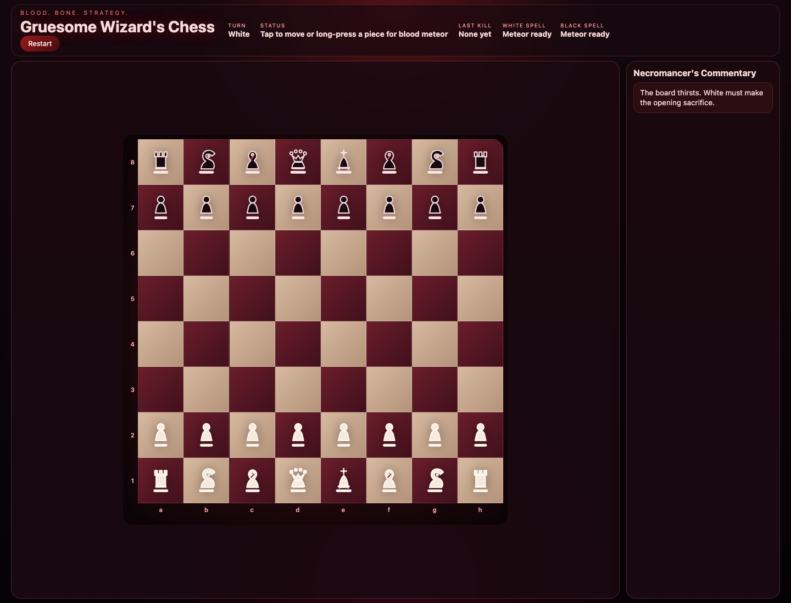
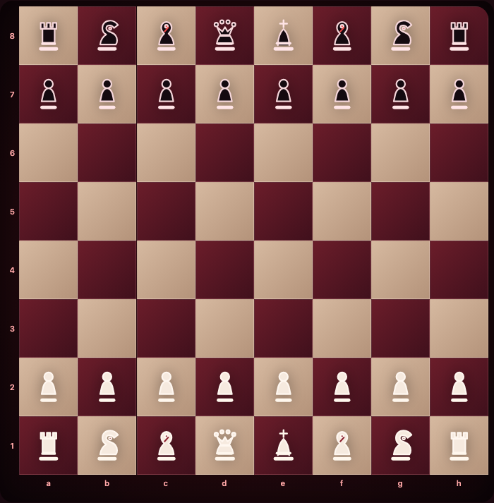
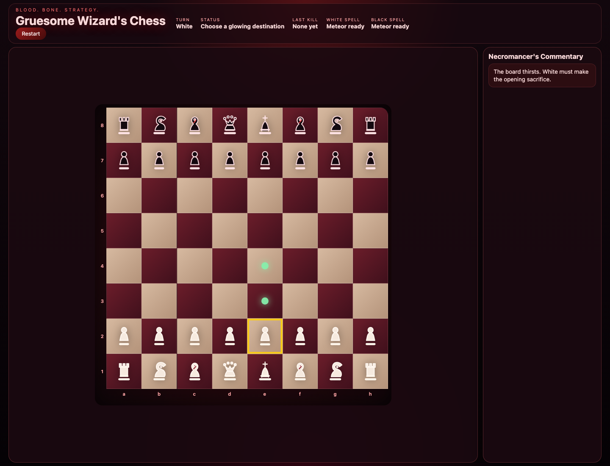
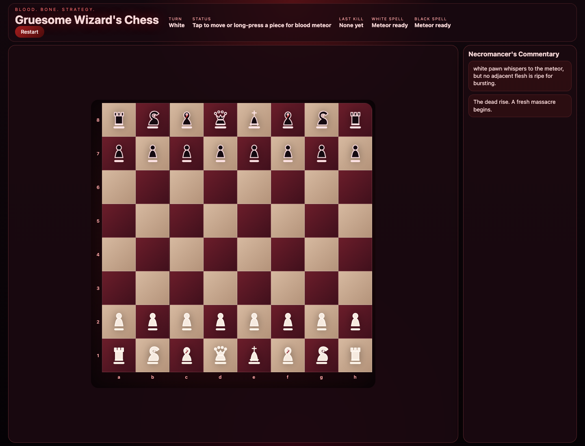
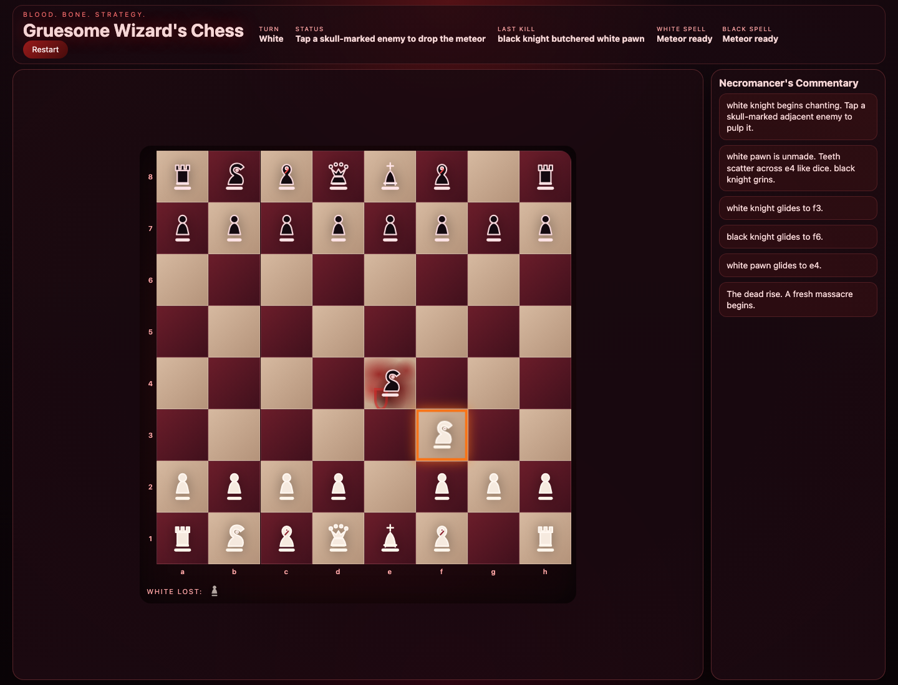
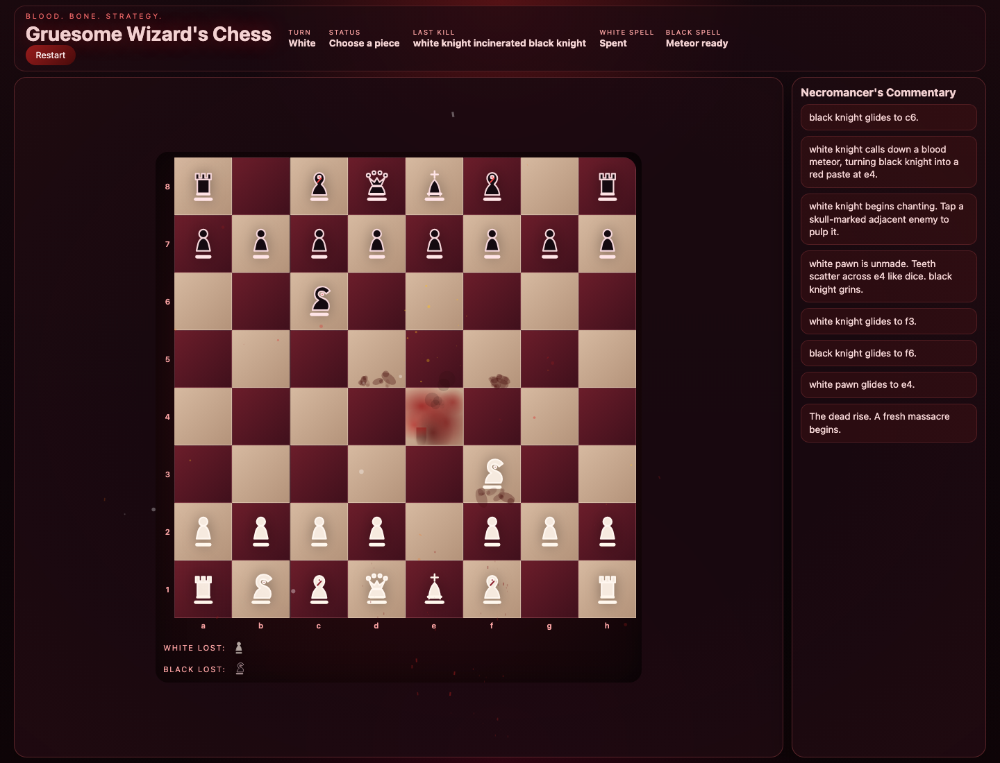
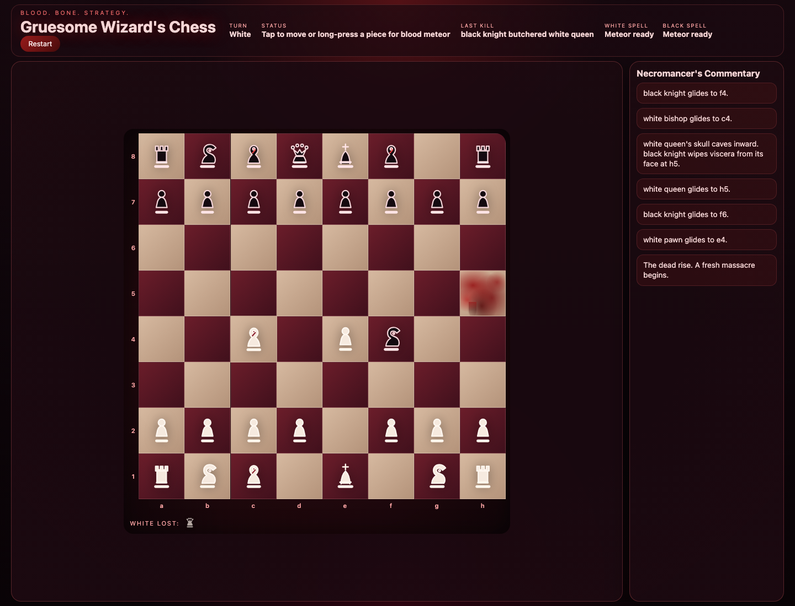
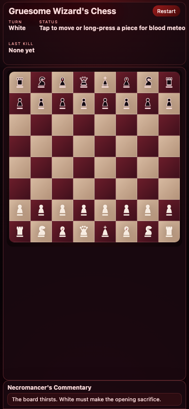

# How to Play Gruesome Wizard's Chess

Generated from the local game UI with Playwright-based captures.

## What this is

Gruesome Wizard's Chess is a single-player chess game where you play White against a black-piece AI. It follows normal chess rules, but adds a one-time Blood Meteor spell for each side and a very theatrical presentation.

## Start screen and layout

The main screen is split into a few important areas:

- **Board**: the 8×8 chessboard in the center-left
- **Top HUD**: shows whose turn it is, the current status, the last kill, and each side's spell availability
- **Restart button**: resets the match immediately
- **Necromancer's Commentary**: a move log on the right that narrates what just happened
- **Captured pieces tray**: appears beneath the board as pieces are taken

## Goal

Win by checkmating the black king.

You always control **White**. The AI controls **Black** and moves automatically after your turn.

## How to make a normal move

1. Click or tap one of your white pieces.
2. The selected square gets a **yellow outline**.
3. Legal destinations light up:
   - **green dots** for normal moves
   - **red rings** for captures
4. Click or tap one of those highlighted squares to complete the move.

You can also **drag and drop** your white pieces on desktop.

## What the HUD means

From the live capture, the HUD includes:

- **Turn**: White
- **Status**: Tap to move or long-press a piece for blood meteor
- **White spell**: Meteor ready
- **Black spell**: Meteor ready

Typical status messages guide you through the game, for example:

- "Choose a piece"
- "Choose a glowing destination"
- "Tap to move or long-press a piece for blood meteor"
- "Black automaton is contemplating murder"

## Using the Blood Meteor spell

Each side gets **one Blood Meteor per game**.

To use it as White:

1. **Long-press** one of your own white pieces for about half a second.
2. If that piece has an **adjacent enemy piece**, the game enters spell mode.
3. Enemy targets that can be destroyed are marked with **red spell rings**.
4. Tap one of those marked enemies to destroy it instantly.

If there is **no adjacent enemy**, the spell does not arm and the commentary log tells you nothing was ripe for bursting.

Here is the spell mode when a valid adjacent enemy exists:

And here is the board immediately after the meteor lands:

Important spell rules visible from the implementation and UI behavior:

- The spell is **one-time-use only**
- It destroys an **adjacent** enemy piece without moving your caster
- It **cannot** target a king
- You still must not leave your own king exposed

## Standard chess rules that are supported

This game implements the usual legal chess rules, including:

- normal piece movement
- captures
- check and checkmate
- stalemate
- castling
- en passant
- pawn promotion

So if you know normal chess, you already know the strategic core.

## Visual feedback during play

The game is very explicit about what is happening:

- selected pieces glow
- legal moves are highlighted
- kings in check are emphasized
- captures leave blood effects and stains
- the last kill is summarized in the HUD
- the commentary panel narrates each move

## Commentary log

The right-hand panel keeps a running log of recent events. Example captured lines:

- black knight glides to f4.
- white bishop glides to c4.
- white queen's skull caves inward. black knight wipes viscera from its face at h5.
- white queen glides to h5.
- black knight glides to f6.
- white pawn glides to e4.

That log is useful for understanding whether a move was normal, a capture, a castle, a spell, check, checkmate, or stalemate.

## Captures and aftermath

Normal captures and Blood Meteor kills both update the board state and the atmosphere:

- the victim is removed
- blood effects appear on the target square
- surrounding squares may get splatter
- the captured pieces tray updates
- the "Last kill" field changes

## Restarting a game

Click **Restart** at any time to reset the board to the initial position and begin a fresh match.

## Mobile layout

The game also has a responsive mobile layout.

On touch devices, tap-to-move is the main input method, and long-press is how you trigger Blood Meteor.

## Fast beginner summary

If you just want the shortest version:

1. Open the game
2. Play as **White**
3. Tap a white piece
4. Tap a highlighted destination
5. Wait for Black to answer
6. Long-press a white piece once per game to use **Blood Meteor** on an adjacent enemy
7. Checkmate the black king
